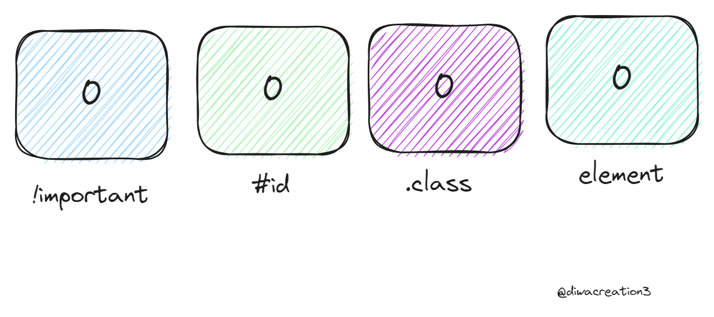
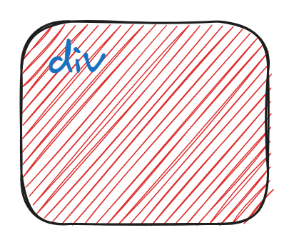
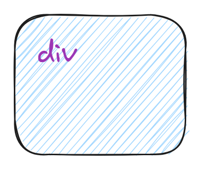
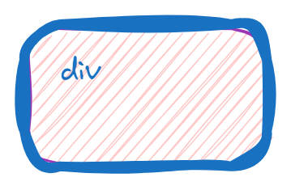
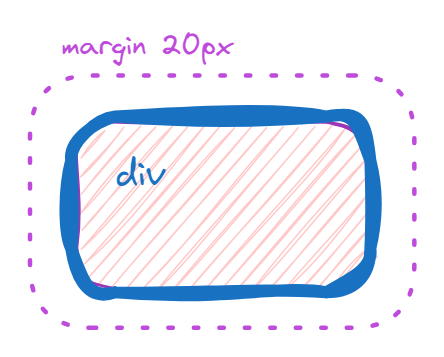
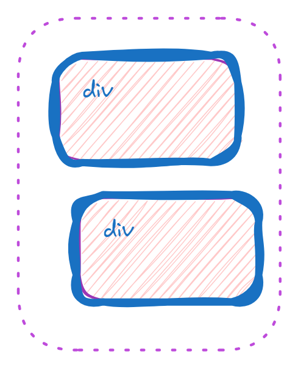
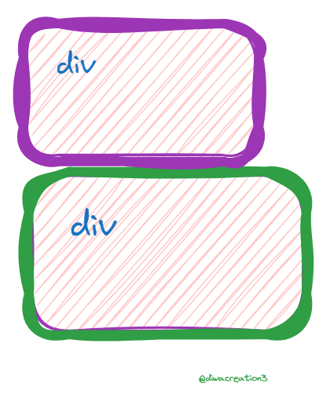

# CSS Initial vs Inherit Vs Unset vs Revert
If you have ever written CSS before then chances are you have had to write CSS like this.
```css
.btn{
    background: none;
    border: none;
    font-size: 1rem;
    font-family: Roboto;
}
```
This is because browsers give us default CSS values that we often manually remove or use a CSS reset to remove. It is often frustrating running into these default styles as they can be a pain to workaround, so in this article I will show you all the different ways you can inherit/reset CSS styles to get the exact look you want.


### What does initial Do?
The easiest CSS value to understand is initial. This value just resets the CSS property to its initial value. You may be confused when using this, though, because the initial CSS value for properties is not always what you think it is since it often differs from the browser’s default styles.
Take for example a simple div. Everyone knows that a div is a display block element, but that display block value actually comes from the default styles of the browser. The initial value for the display property in CSS is actually inline. This means if you set a div’s display property to initial then it will become an inline element.

In order to understand a bit more how this works we need to talk about the three layers of CSS, default/initial styles, browser styles, and custom styles.
The default or initial styles are just the default values of every CSS property defined in the CSS specifications. These can easily be found by checking the documentation for any CSS property on MDN.

Browser styles are the specific styles that each browser assigns to elements such as buttons, block quotes, headings, etc. This is why a button in Safari looks much different than a button in Chrome. They have two separate browser stylesheets.
Finally, we have custom styles which are any styles that you write or include on the page. This can be anything from inline CSS to a CSS stylesheet you link in the head of the HTML.

### What does inherit Do ?
In CSS many properties inherit values from their parent. For example, font-family, color, and many other properties inherit their values by default. This is why you can set the color of a div to green and have all that div’s children also have green text. By setting a CSS property’s value to inherit you are saying that you want the value of the CSS property to be equal to the value of it’s parent’s property. If the parent is inheriting that property then it will continue to go up the chain until it finally finds a specific value set on one of the parent’s.

For example, if I give a div a 1px solid black border and put a child inside that div then we know the border will only show up on the parent div and not the child. If I set the border property to inherit on the child, though, then that child will also have a 1px solid black border.

This is a very useful value to have since some elements, like buttons, have a specific font-family set in the browser style sheet, but you most likely want to inherit that font-family to match the rest of your site. This is why I almost always set my buttons to inherit their font-family.

```css
div{
    color:green;
}
.blue{
    color: blue;
}
p.important {
    color: inherit
}

```
```html
<div>
    <p class="important-blue"> This is red</p>
</div>    
```

###  What does unset Do?
unset is an interesting property since it will either do the same thing as initial or inherit. If a CSS property naturally inherits, such as color, font-family, etc. then it will act the same as inherit. If a CSS property does not naturally inherit, such as display, border, etc. then it wil act the same as initial. At first this may not seem very useful since you can just manually put inherit/initial as the value, but this value shines when using the all property.

The all property allows you to set one value for every single property of an element. This is really useful if you want to remove all browser specific styles from an element such as a button.

```css
.btn-all{
    all: unset;
}
.btn-no-all{
    background: initial;
    border: initial ;
    font-size: inherit;
    font-family: inherit;
}
```

# CSS Specificity Demystified
Creating amazing looking websites with CSS is a ton of fun, but as the CSS grows it becomes harder and harder to properly overwrite styles in the cascade. The CSS starts filling up with !important declarations and the cascade is nearly impossible to follow. This is a common problem that I have run into before and I am sure you have as well, so in this article I am going to explain CSS specificity in depth so you can start building well structured, easy to maintain CSS stylesheets.

## What is Specificity ?
Specificity is the process that CSS uses to determine which styles overwrite other styles. This can be as simple as a selector’s position in a stylesheet, but is often much more complex than that. The best way to think of specificity is as an array of four numbers per selector. These four numbers represent the four ways that CSS determines specificity.




# CSS Box Model

## What is the Box Model ?

One incredibly important thing to understand about CSS is that everything is a rectangular box. Everything from text, to buttons, to inputs are represented by a box in CSS. Even if you draw a circle with CSS it will still be represented by a box when it is drawn on screen. This box is composed of multiple parts which in total make up the box model.

### Content 

The content of a box is everything nside the box. This usually some form os text or a hard coded width and height. Below we have a simple div and everything with the red background color is the content of the box.

```css
div{
    background-color: red;
    height: 100px;
    width: 100px;
}
```


### padding
The next portion of the box model is the padding and this comes directly outside the content. padding allows you to add extra space to your element without making the content itseld larger. this is perfect for when you need to add space between the edge of your background and your element content like with a button.

```css
div{
    padding: 20px;
    background-color: blue;
    height: 100px;
    width: 200px;
}
```


### Border 
The next layer of the box model is the border and the border is the layer that goes between the padding and the outsdie of the element. it is also the last part of the box model that contributes to the overall size of box.
```css
div{
    border: 30px solid blue;
    padding: 20px;
    background-color: red;
    height: 100px;
    width: 200px;
}
```




### Margin
The final piece of the box model is margin. margin is simply the space betwwen different elemens and occurs outside the border. Margin also does not contribute to the actual size of an element since it is outside the border.

```css
div{
    margin:20px;
    border: 30px solid blue;
    padding: 20px;
    background-color: red;
    height: 100px;
    width: 200px;
}
```


### Margin Collapse
in the box margins betwwen two different elements wll collaspe. This means that if two elements that are siblings in the HTML both have a margin they will collapse so that only the latgest of the two margins is used betwwen the elements.

```css
.top-div{
    margin:30px;
    background-color: red;
    height: 100px;
    width: 100px;
}

.bottom-div{
    margin: 40px;
    background-color: red;
    height: 100px;
    width: 100px;
}
```



### Box Sizing
One of the most important properties in CSS, box-sizing, can be used to change how the box model calculates sizes. By default the box-sizing of all elements is set to content-box which means the content of the element will be the exact width/height defined by the width and height properties in CSS. An alternative value is the border-box value which means the width/height properties in CSS will represent the width/height of the content combined with the border and padding.

```css
.top-div {
  box-sizing: border-box;
  background-color: red;
  height: 100px;
  width: 200px;
  padding: 20px;
  border: 10px solid purple;
}

.bottom-div {
  box-sizing: content-box;
  background-color: orange;
  height: 100px;
  width: 200px;
  padding: 20px;
  border: 10px solid green;
}
```


The top and bottom div both have the same height/width in CSS, but the bottom div appears much larger. This is because the content of the div is 200px wide in the bottom div while in the top div the content + padding + border is 200px wide. The top div content is actually only 140px wide since 40px of space is taken up by the padding and 20px is taken up by the border.

This property may seem a bit useless at first, but being able to set the height/width of an element and having that size include the entire content, border, and padding is incredibly useful. This is why most stylesheets will change the box sizing for all elements.

```css
*,
*::before,
*::after {
  box-sizing: border-box;
}
```