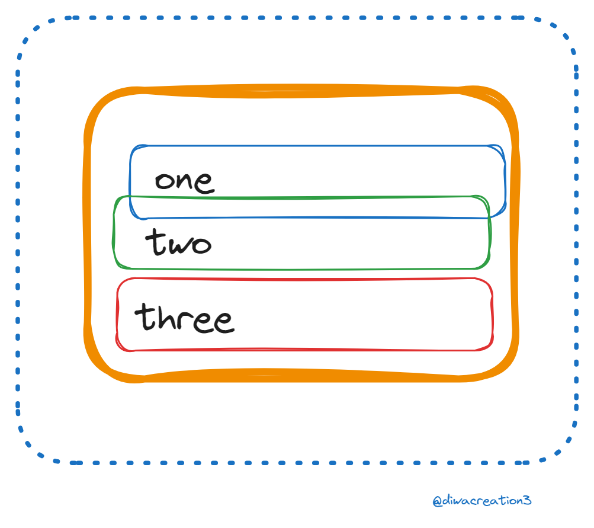
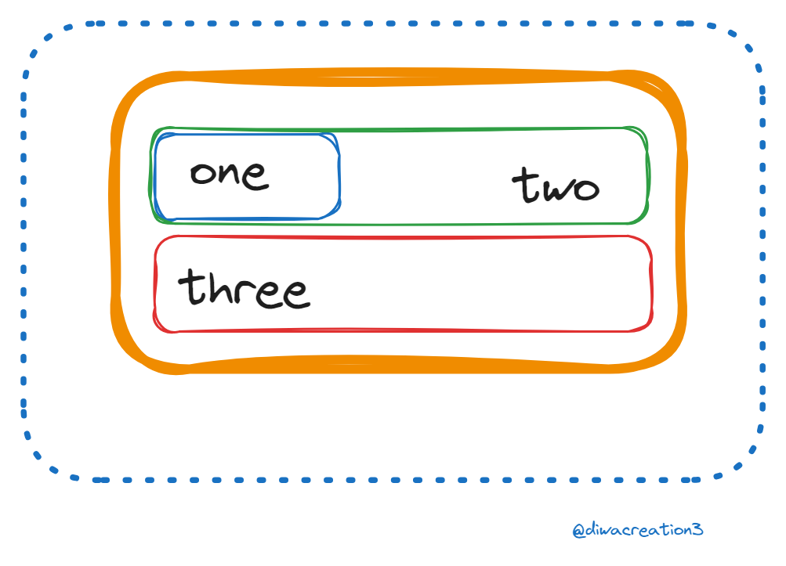
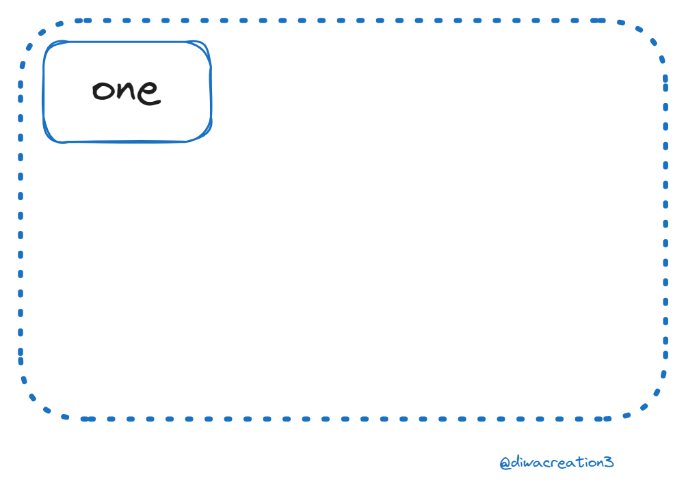

# 🌿 CSS Position
# 🍃 [Display](#display-1)


The position property in CSS only has a few valid values, but those values can lead to endless design possibilities which makes learning position quite difficult.

### Static Position
To start we are going to cover the easiest position value which you probably have never heard of but use all the time and that is the static position. static is the default value for the position property and essentially just means that an element will follow the normal document flow and will position itself based on the standard positioning rules.

Any element that you do not apply a position property to will be static which means most elements you work with are statically positioned. static positioned elements cannot have the z-index, top, left, right, or bottom properties applied to them.

```css
.one{
    position: static;
}
```


### Relative Position

The Next simplest position type is relative position. A relative position element works exactly the same as static position, bur you can now add z-index, top, left, right and bottom properties to it. if you make an element relative positioned without setting any of these extra properties you will notice it looks exactly the same as a static positioned element. this is because relative positioned elements aslo follow the normal document flow, but you can offset them using the top, left, right and bottom properties.

```css
.one{
    position: relative;
}
```


```css
.one{
    position: relative;
    top: 30px;
    left: 10px;
}
```


From the above example you can see that the one element works just like static when there is no extra properties defined. Once you add a property like left, or top, though, you can see that the element offsets itself relative to its normal position by these top, left, right, and bottom properties. You will notice, however, that the other elements do not move to account for the offset position of the relative positioned element. This is because all the other elements assume that the relative positioned element has no offsets and they determine their position based on where the relative positioned element would have been if it was static.

Now on its own relative position is not that useful as you do not usually want to offset an element without also moving all the elements around it. The main use cases for position relative are to either set the z-index of the element, or to be used as a container for absolute positioned elements which we will talk about next

### Absolute Position
The absolute position is the first position that completely removes the element from the normal document flow. If you give an element position absolute all other elements will act as if the absolute positioned element doesn’t even exist.

```css
.one{
    position:absolute;
}
```


As you can see elements two and three are laid out as if element one never even existed. You will also notice that element one no longer fills the full width. This is because absolute positioned elements have their width defaulted to auto instead of being full width like a div. Also, by default an absolute positioned element will place itself in the document where it normally would have rendered if it was a static element, but we can change that with the top, left, right, and bottom properties.

```css
.one{
    position: absolute;
    top: 0;
    left: 0;
}

```


Now you can see our element has moved to the top left corner of our dashed border. I am using this dashed border to represent the entire screen since by default a position absolute element will position itself relative to the body so a top and left of 0 means the element will appear in the top left corner of the body. You can change the element that the absolute positioned element is positioned off of by setting the position of one of its parent elements to anything other than static. This is one of the most common places relative position is used.

### Fixed Position
Now we come to one of the lesser used positions which is fixed position. fixed position is a bit like absolute position in that it removes the element from the document flow, but fixed position elements are slways positioned relative to the acreen no matter what position its parent elements are.

```css
.one{
    position: fixed;
    top: 0;
    left: 0;
}
```


### Sticky Position

The final position value is sticky. this position is a combination of both fixed and static position and combined the best of them both. An element with position sticky will act like a static positioned element until the page scrolls to a point where the elements hits the top, left, right or bottom value specified. it will then act like a fixed position element and scroll with the page until the elment gets to the end of its container.

```css
.one{
    position: sticky;
    top: 10px;
}
```
# Display
