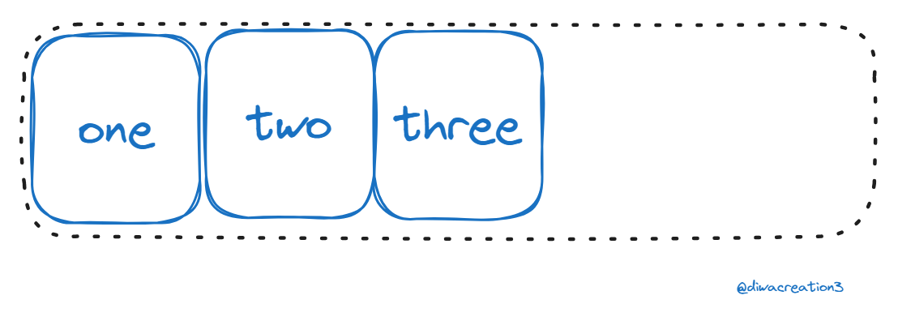
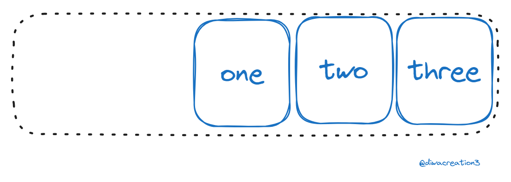
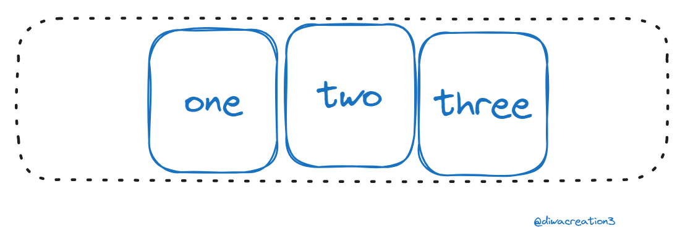
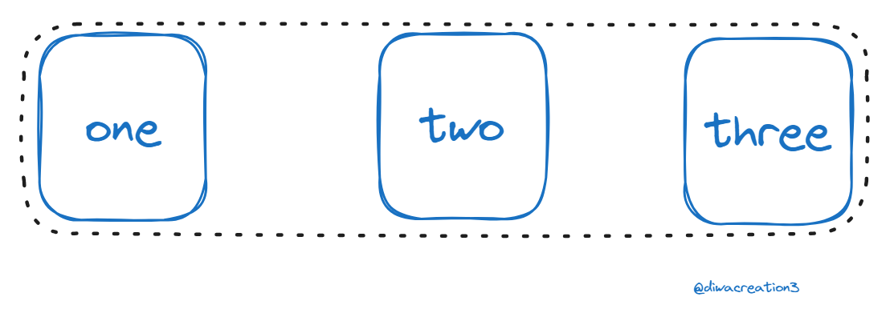
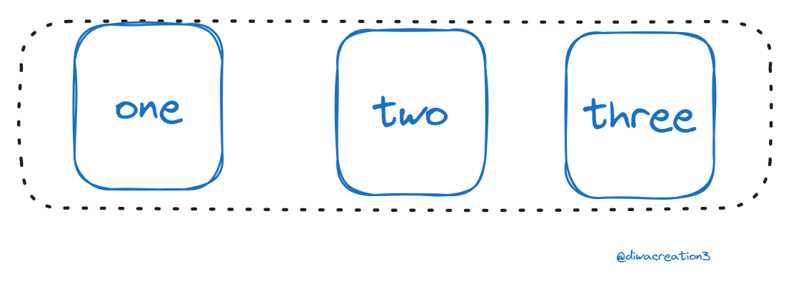

# CSS Flexbox

### Whats is Flexbox ?
Flexbox is a way to layout elements in CSS and is broken into a two main components. The flexbox container and flexbox items. The flexbox container is the parent element that contains all the flexbox items as its children. The flexbox container is where you define all your properties about the flexbox layout and then on the individual items you can make additional tweaks. Let’s take a look at how we would get started with a simple flexbox example. If we have an element with children inside of it all we need to do is set the display property of the parent element to flex and we will have a flex container. display: flex


### Flexbox layout

Flexbox was the first CSS layout method that worked in a completely different way than normal CSS. Instead of worrying about block/inline elements flexbox worries about a main axis and a cross axis.

#### justify-content
```css
.flex-item{
    width: 20%;
}
```
#### flex-start
Places all items at the start of the main axis which is the left side of the axis by default. This is also the default behavior of justify-content.
```css
.flex-container{
    display:flex;
    justify-content:flex-start;
}
```


#### flex-end
places all items at the end of the main axis which is the right side of axis by default.

```css
.flex-container{
    display: flex;
    justify-content: flex-end;
}
```


#### center
Places all items in the center of the main axis. This is one of the easiest ways to center elements in CSS.

```css
.flex-container {
  display: flex;
  justify-content: center;
}
```


#### Space between
This takes all the extra space insdie the container and evenly spreads it betwwen each element to space them as far apart as possible from one another while filling the full container.

```css
.flex-container {
  display: flex;
  justify-content: space-between;
}
```


### Space-around
This is very similar to space-between, but it also adds space between the outside of the container and the first/last element. The amount of space between the outside of the container and first/last element is exactly half the amount of space between elements 

```css
.flex-container {
  display: flex;
  justify-content: space-around;
}
```

