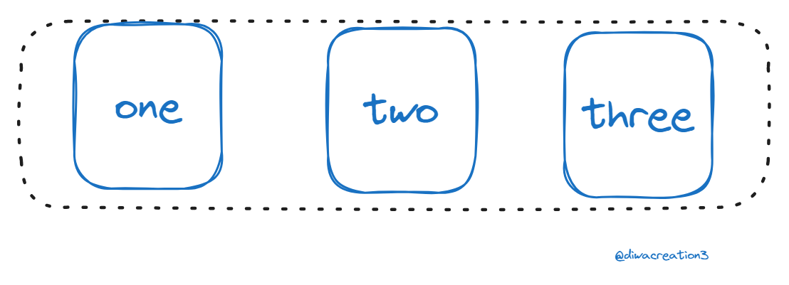
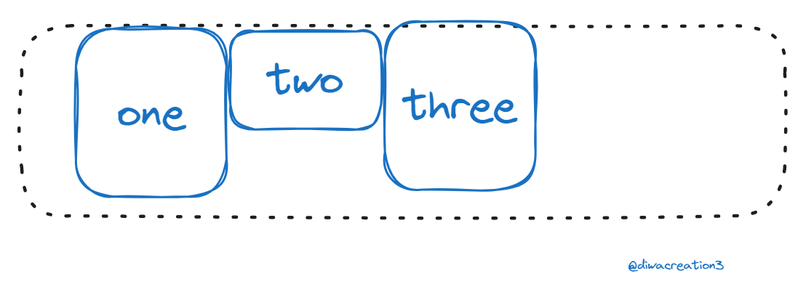
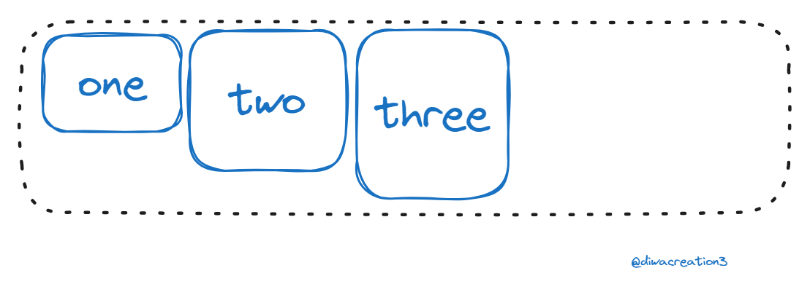

# CSS Flexbox

### Whats is Flexbox ?
Flexbox is a way to layout elements in CSS and is broken into a two main components. The flexbox container and flexbox items. The flexbox container is the parent element that contains all the flexbox items as its children. The flexbox container is where you define all your properties about the flexbox layout and then on the individual items you can make additional tweaks. Let’s take a look at how we would get started with a simple flexbox example. If we have an element with children inside of it all we need to do is set the display property of the parent element to flex and we will have a flex container. display: flex


### Flexbox layout

Flexbox was the first CSS layout method that worked in a completely different way than normal CSS. Instead of worrying about block/inline elements flexbox worries about a main axis and a cross axis.

#### justify-content
```css
.flex-item{
    width: 20%;
}
```
#### flex-start
Places all items at the start of the main axis which is the left side of the axis by default. This is also the default behavior of justify-content.
```css
.flex-container{
    display:flex;
    justify-content:flex-start;
}
```


#### flex-end
places all items at the end of the main axis which is the right side of axis by default.

```css
.flex-container{
    display: flex;
    justify-content: flex-end;
}
```


#### center
Places all items in the center of the main axis. This is one of the easiest ways to center elements in CSS.

```css
.flex-container {
  display: flex;
  justify-content: center;
}
```


#### Space between
This takes all the extra space insdie the container and evenly spreads it betwwen each element to space them as far apart as possible from one another while filling the full container.

```css
.flex-container {
  display: flex;
  justify-content: space-between;
}
```


### Space-around
This is very similar to space-between, but it also adds space between the outside of the container and the first/last element. The amount of space between the outside of the container and first/last element is exactly half the amount of space between elements 

```css
.flex-container {
  display: flex;
  justify-content: space-around;
}
```


#### space-evenly
This is very similar to space-around, but the space between the outside of the container and the first/last element is the same as the space between elements instead of half the size.

```css
.flex-container {
  display: flex;
  justify-content: space-evenly;
}
```


#### align-iteams 
For all these examples we will assume that the flex-items all have a width of 20%, but that the elements are all different heights.

```css
.flex-item {
  width: 20%;
}

.flex-item:nth-child(1) {
  height: 75px;
}

.flex-item:nth-child(2) {
  height: 100px;
}

.flex-item:nth-child(3) {
  height: 125px;
}
```
#### stretch (default)
This will stretch all items to fill the full height of the cross axis unless they have a specific height set. In our example I set the height of the first child to initial which is essentially the same as if we had never set a height on the first child. By default when a div has no height it will just be the height of the content inside of it, but as you can see below the first child fills the full height of the container since it is stretching to fill the full height. The second element is not stretching, though, since we set a specific height of 100px on it. This is the default behavior of align-items.

```css
.flex-container {
  display: flex;
  align-items: stretch;
}

.flex-item:nth-child(1) {
  /* This is the same as if we had not set a height */
  height: initial;
}
```


#### flex-start
This works the same as flex-start for justufy-content, but will start at the top os the cross axis by default.
```css
.flex-container{
    display: flex;
    align-iteams: flex-start;
}
```


#### flex-end
This works same as flex-end for justify-content, but will start at the bottom of the cross axis by default

```css
.flex-container {
  display: flex;
  align-items: flex-end;
}
```
.png)

### center
this works same as center for justify-content, but will be center based on the cross axis

```css
.flex-container {
  display: flex;
  align-items: center;
}
```
.png)

Now this covers all the ways you can layout elements along the main and cross axis, but there is one more important thing you need to know about flexbox axes. They can actually be swapped. There is a property called flex-direction which determines the orientation of the main and cross axis.

#### flex-direction
This property allows us to determine which direction each axis corresponds to as well as where the axis start

####
row(default)
The default direction is row. This means the main axis is horizontal while the cross axis is vertical. This also means the main axis starts on the left while the cross axis starts at the top.

